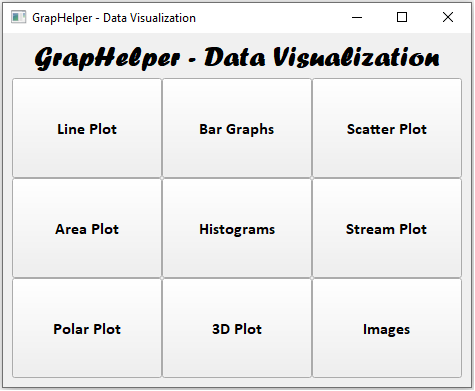
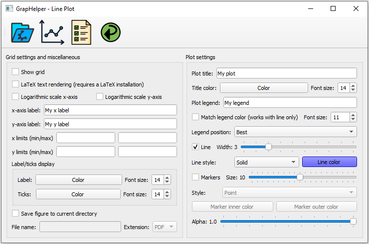
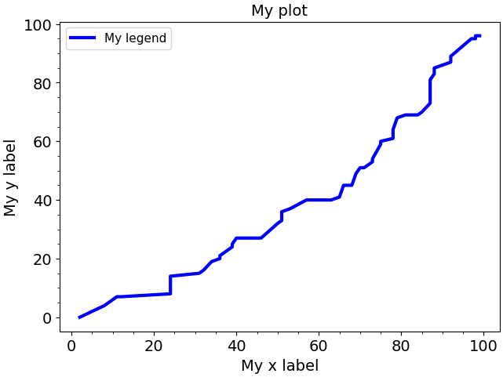
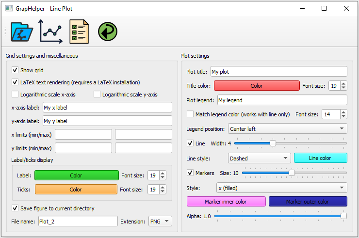
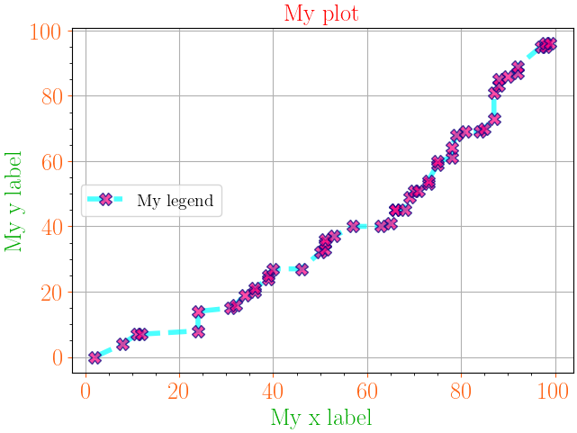

# GrapHelper
Simple GUI software to do graphs using Matplotlib and PyQt5.
\
So far, only the line plot is available. It allows:
- CSV file load and read
- Grid display
- LaTeX text rendering (assuming a working LaTeX installation)
- Logarithmic scaling
- Setting labels limits
- Custom label color and font size
- Custom ticks color and font size
- Title/legend labels, color and font size
- Line style and width
- Markers style and size
- Overall alpha
- Saving the figure with different format (.pdf, .png, .jpg, .bmp)
- One test case

Could be implemented:
- Multiple plots support
- Error bars
- Annotations
- Embedded plotting

Main frame:

Line plot with two examples:\
#1\

\

#2\

\
